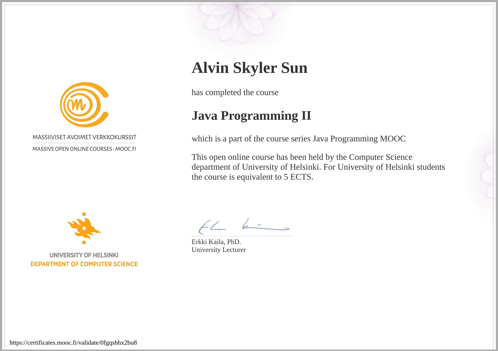

# mooc.fi-java-course
**My submissions for the java massive open online course (mooc.fi) by University of Helsinki!**

This repository contains all of my submissions for the Programming with Java course by University of Helsinki. Feel free to use my submissions as a guide or as a comparision to help you complete this course. If you do plan to use my submissions for the course, I hope you to understand what steps I take in each solution, **do not copy and paste** as you will not learn anything. Happy coding! 

# About the course

This is one of University of Helsinki's most popular programming course, **Programming with Java**. This course used to give ECTS once completed, but now it remains as a leagacy course, which is replaced by the new python course. The course is divided into two parts, with each part being divided into seven chapters per part with a total of 14 chapters to complete! The first part mainly focuses on an introduction to programming in general with the second part being focused on the Object Orientated stuff. for more information check out the course [here](https://java-programming.mooc.fi/).  

# Completion Certificate 

